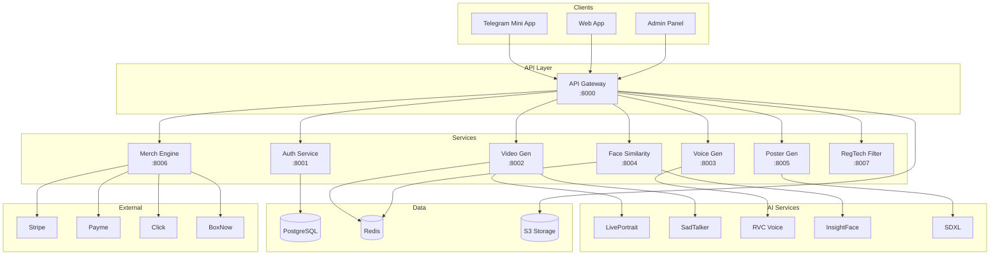
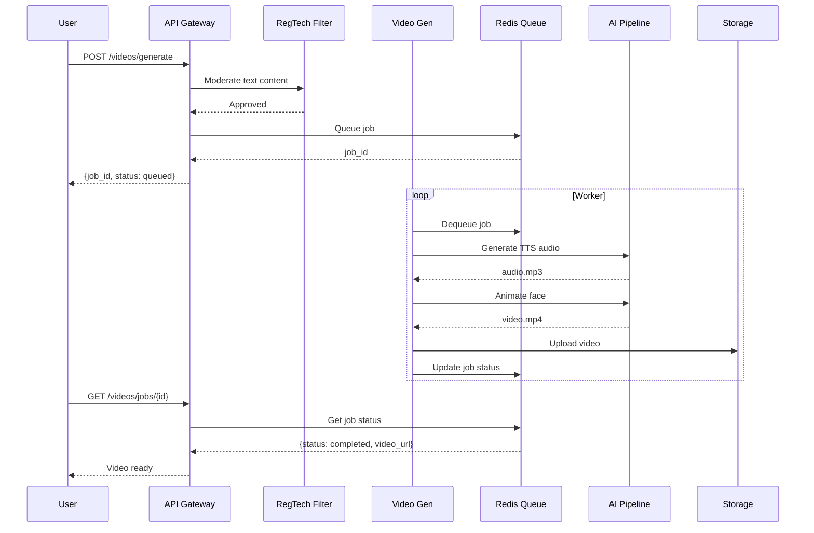
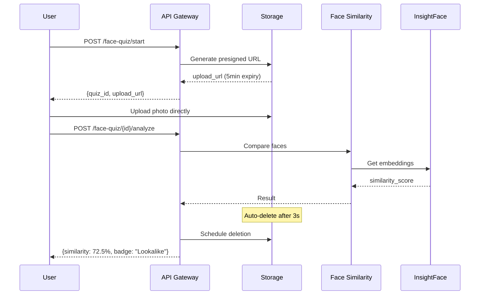
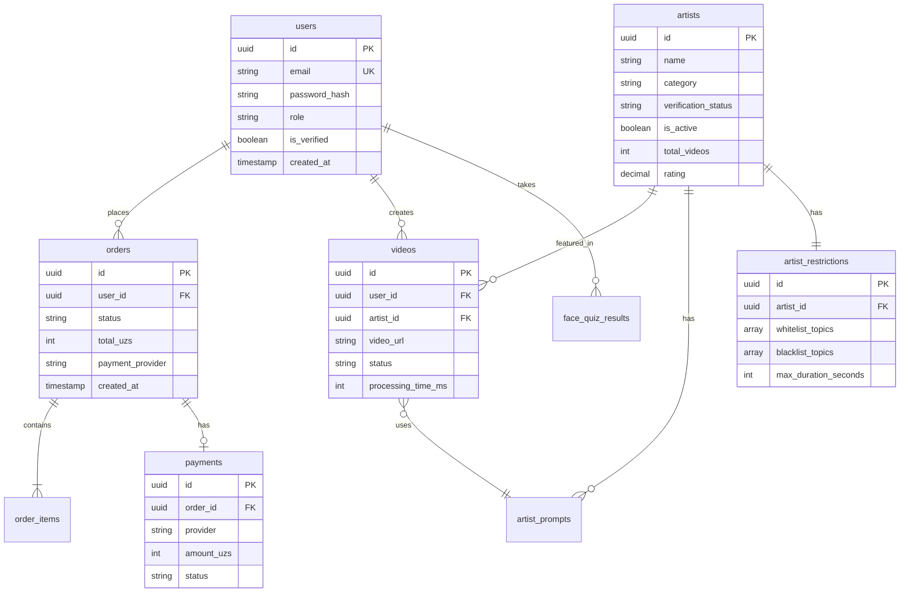

# Stario Platform - System Architecture

## Overview

Stario is an AI-powered platform for creating personalized video greetings, face quizzes, and merchandise with celebrity artists.

## Architecture Diagram

## Data Flow: Video Generation

## Data Flow: Face Quiz (PII Compliant)

## Database Schema (ERD)

## Technology Stack

| Component | Technology | Purpose |
|-----------|------------|---------|
| API Gateway | FastAPI (Python) | Request routing, auth, rate limiting |
| Auth | JWT + OAuth2 | Authentication & authorization |
| Video Gen | LivePortrait, SadTalker | Face animation |
| Voice Gen | RVC, FastSpeech2 | Voice cloning & TTS |
| Face Similarity | InsightFace | Face recognition |
| Poster Gen | SDXL | Image generation |
| Database | PostgreSQL 15 | Primary data store |
| Cache/Queue | Redis 7 | Caching, job queues |
| Storage | S3/MinIO | Object storage |
| Container | Docker, Kubernetes | Orchestration |
| CI/CD | GitHub Actions | Automation |
| Monitoring | Prometheus, Grafana | Observability |

## Performance Requirements

| Metric | Target | Implementation |
|--------|--------|----------------|
| Video Generation | ≤40s | GPU queue, parallel processing |
| Poster Generation | ≤5s | Optimized SDXL inference |
| Face Similarity | ≤200ms | Pre-computed embeddings |
| Daily Capacity | 10k requests | Horizontal scaling |
| Uptime | 99.9% | Multi-AZ deployment |

## Security Architecture

### Authentication Flow
1. User authenticates via email/password or Telegram
2. JWT access token (30min) + refresh token (7 days)
3. RBAC: admin, operator, validator, artist, user

### Data Protection
- Encryption at rest (AES-256)
- Encryption in transit (TLS 1.3)
- PII minimization (ephemeral uploads)
- Audit logging (90-day retention)

### Compliance
- Data residency: Uzbekistan
- Legal export capability
- Artist verification workflow
