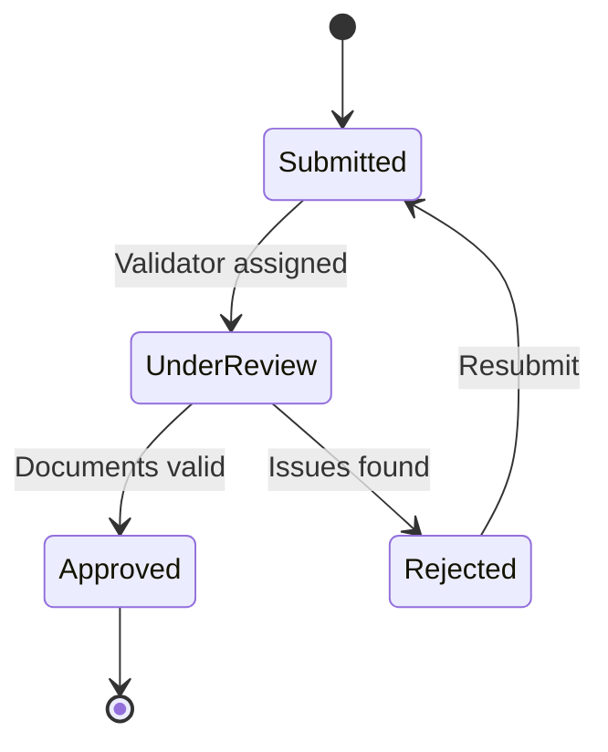

# Uzbekistan Compliance Guide (2025-2030)

## Overview

This document outlines compliance requirements for Stario platform operations in Uzbekistan according to local regulations for 2025-2030.

## Data Residency Requirements

### Storage Location
- All user data MUST be stored within Uzbekistan territory
- Primary database: Local data center or cloud region
- Backups: Must remain within country borders
- CDN: Edge caching allowed, but original data stays local

### Implementation
```yaml
# Kubernetes ConfigMap
DATA_RESIDENCY_REGION: "uz"
S3_ENDPOINT: "https://s3.uz-tashkent-1.example.com"
DATABASE_REGION: "uz-tashkent"
```

## Personal Information Minimization

### Face Quiz Photo Handling
1. Photos are uploaded directly to S3 via presigned URL
2. Processing occurs within 200ms
3. **Automatic deletion within 3 seconds** unless user opts in
4. No face data stored permanently without explicit consent

### Implementation
```python
# Ephemeral upload configuration
EPHEMERAL_UPLOAD_TTL_SECONDS = 3

async def schedule_deletion(key: str, delay_seconds: int = 3):
    await asyncio.sleep(delay_seconds)
    s3.delete_file(bucket, key)
```

### User Data Retention
| Data Type | Retention Period | Justification |
|-----------|-----------------|---------------|
| Account data | Until deletion request | Service operation |
| Order history | 5 years | Tax requirements |
| Generated content | 90 days default | User access |
| Audit logs | 90 days | Security/Compliance |
| Analytics | 2 years (anonymized) | Business insights |

## Audit Logging Requirements

### What Must Be Logged
- User authentication events
- Content generation requests
- Payment transactions
- Admin actions
- Data access by staff
- Data exports

### Log Structure
```json
{
  "timestamp": "2025-01-20T10:30:00Z",
  "action": "content.moderated",
  "actor_id": "usr_123",
  "resource_type": "video",
  "resource_id": "vid_456",
  "ip_address": "192.168.1.1",
  "details": {
    "status": "approved",
    "flags": []
  }
}
```

### Retention
- Logs retained for 90 days minimum
- Archived to cold storage after 90 days
- Complete deletion after 1 year (configurable)

## Legal Data Export (Seizure Scenarios)

### Export Package Contents
When authorities request data:
1. User profile information
2. All generated content
3. Transaction history
4. Audit logs
5. Moderation decisions
6. Communication logs

### API Endpoint
```
POST /content/legal-export
{
  "case_id": "LEGAL-2025-001",
  "date_from": "2025-01-01",
  "date_to": "2025-01-20",
  "user_ids": ["usr_123"],
  "include_logs": true,
  "include_content": true
}
```

### Export Process
1. Request received with court order reference
2. Admin verifies authorization
3. System generates encrypted package
4. Package includes:
   - `users.json` - User data
   - `content/` - Generated videos/images
   - `logs.json` - Audit trail
   - `transactions.json` - Payment records
   - `manifest.json` - Package contents
5. Secure transfer to authorities

## Artist Verification

### Required Documents
1. **Passport/ID** - Government-issued identification
2. **Contract** - Agreement with platform terms
3. **Tax registration** - If applicable

### Verification Flow


### Admin UI Verification Page
- Document viewer
- Identity verification checklist
- Approval/rejection with notes
- Audit trail of decisions

## Content Moderation

### Prohibited Content
1. **Political content** - Threshold: 0.8
2. **NSFW content** - Threshold: 0.7
3. **Violence** - Threshold: 0.7
4. **Misinformation** - Threshold: 0.75
5. **Hate speech** - Zero tolerance

### Per-Artist Restrictions
```json
{
  "artist_id": "art_001",
  "whitelist_topics": ["birthday", "greeting", "holiday"],
  "blacklist_topics": ["politics", "religion", "violence"],
  "max_video_duration_seconds": 60,
  "custom_rules": "Family-friendly content only"
}
```

## Data Subject Rights

### Export Request (GDPR-style)
```
POST /users/me/export
{
  "format": "json",
  "include_orders": true,
  "include_generated_content": true
}
```
Response within 24 hours.

### Deletion Request
```
POST /users/me/delete
{
  "confirm_email": "user@example.com",
  "reason": "No longer using service"
}
```
- 30-day grace period
- Irreversible after grace period
- Some data retained for legal requirements

## Checklist for Compliance

### Before Launch
- [ ] Data stored in Uzbekistan region
- [ ] Ephemeral upload deletion working (3s)
- [ ] Audit logging enabled
- [ ] Legal export tool tested
- [ ] Artist verification flow complete
- [ ] Content moderation thresholds set
- [ ] Data retention policies configured
- [ ] Privacy policy in Uzbek language
- [ ] Terms of service approved

### Ongoing Operations
- [ ] Monthly audit log review
- [ ] Quarterly security assessment
- [ ] Annual compliance review
- [ ] Regular data retention cleanup
- [ ] Incident response drills

## Incident Response

### Data Breach Protocol
1. Identify scope within 1 hour
2. Contain breach within 4 hours
3. Notify authorities within 72 hours
4. Notify affected users within 7 days
5. Document incident and remediation

### Contact Information
- Compliance Officer: compliance@stario.uz
- Legal Department: legal@stario.uz
- Security Team: security@stario.uz
